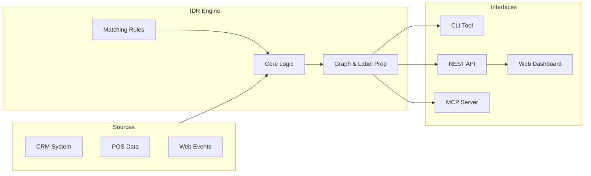

# 🔗 SQL Identity Resolution

[](https://github.com/anilkulkarni87/sql-identity-resolution/actions/workflows/test.yml)
[](https://anilkulkarni87.github.io/sql-identity-resolution/)
[](https://opensource.org/licenses/Apache-2.0)
[](https://github.com/anilkulkarni87/sql-identity-resolution/stargazers)

[](https://www.snowflake.com/)
[](https://cloud.google.com/bigquery)
[](https://databricks.com/)
[](https://duckdb.org/)

**Production-grade deterministic identity resolution** for modern data warehouses. Unify customer identities across CRM, transactions, web events, and loyalty data—**no ML required**.

## ⚡ 60-Second Demo

```bash
# Install and run
pip install "sql-identity-resolution[duckdb,api,mcp]"
idr quickstart
```

That's it! The engine will:
1. Generate **10,000 synthetic records**
2. Initialize a local DuckDB warehouse
3. Run the resolution pipeline
4. Output identity clusters and statistics

## 🎯 Why SQL Identity Resolution?

| Challenge | Our Solution |
|-----------|--------------|
| **Expensive CDPs** | Open source, runs on your warehouse |
| **Black-box ML** | Deterministic rules, fully auditable |
| **Vendor lock-in** | Same logic across 4 platforms |
| **Scale limits** | Tested to 100M+ rows |

## ✨ Key Features

- **Unified Core Package** - Same logic everywhere via `idr_core`
- **🤖 MCP Server** - Native integration with Claude Desktop & Cursor for AI agents
- **🖥️ Web UI** - Visualization dashboard and setup wizard
- **🎯 Confidence Scoring** - Cluster quality metrics (0-1)
- **🔒 Dry Run Mode** - Preview changes before committing
- **🛡️ Data Quality Controls** - strict mode, max_group_size, exclusion lists
- **📈 Incremental Processing** - Watermark-based efficiency at scale
- **🔍 Full Audit Trail** - Every decision is traceable

## 📊 Architecture



## 🚀 Getting Started

### Option 1: CLI (Standard)

The `idr` CLI is the standard way to run on all platforms.

```bash
# 1. Initialize DB
idr init --platform [duckdb|bigquery|snowflake|databricks]

# 2. Configure (using YAML)
idr config apply --platform [platform] --file config.yaml

# 3. Run
idr run --platform [platform] --mode FULL
```

### Option 2: AI Agent (MCP)

Enable your AI assistant (Claude, Cursor) to understand and query your identity graph.

```bash
# Start MCP Server
export IDR_PLATFORM=duckdb
export IDR_DATABASE=./my_data.duckdb
idr mcp
```

See [MCP Documentation](idr_mcp/README.md) for setup details.

### Option 3: Web UI

Visualize your graph and configure rules visually.

```bash
# Start API only
idr serve
```

Open API docs at http://localhost:8000/docs.

For full UI + API stack:
```bash
docker compose up --build
```
Open http://localhost:3000.

For pinned-image deployment:
```bash
cp .env.example .env
docker compose -f docker-compose.prod.yml --env-file .env up -d
```

## 🏭 Industry Templates

Pre-built configurations for common use cases:

| Template | Use Case | Identifiers |
|----------|----------|-------------|
| [Retail](examples/templates/retail/) | Nike, Lululemon style | email, phone, loyalty_id, address |
| [Healthcare](examples/templates/healthcare/) | Patient matching | MRN, SSN, name+DOB |
| [Financial](examples/templates/financial/) | Account linking | account_id, email, SSN |
| [B2B SaaS](examples/templates/b2b_saas/) | Lead deduplication | email, domain, company_name |

## 🤝 Contributing

We welcome contributions! See [CONTRIBUTING.md](CONTRIBUTING.md) for guidelines.

```bash
# Dev setup
pip install -e ".[dev,duckdb]"
pre-commit install
ruff check .
```

## 📜 License

Apache 2.0 — see [LICENSE](LICENSE)

---

<p align="center">
  <b>⭐ Star this repo if you find it useful!</b>
</p>
