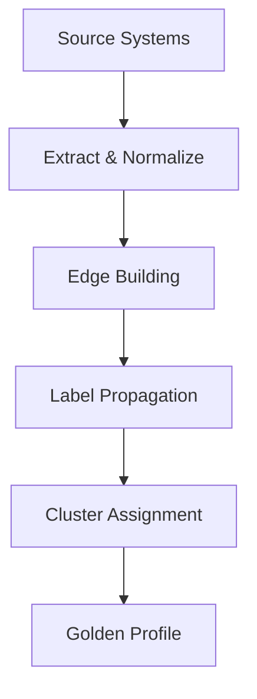

# Architecture

System architecture and data flow.

## High-Level Design

## Layers

### 1. Metadata (`idr_meta`)
*   **Source Registry**: Definitions of input tables.
*   **Rules**: Exact and fuzzy matching logic.
*   **Mappings**: Transformations for identifiers and attributes.

### 2. Processing (`idr_work`)
*   **Transient State**: `identifiers`, `edges_new`, `lp_labels`.
*   **Incremental Delta**: Only processes changed records.

### 3. Output (`idr_out`)
*   **Identity Graph**: `identity_resolved_membership_current`.
*   **Profiles**: `golden_profile_current`.
*   **Audit**: `run_history`.

## Cross-Platform Execution
The core logic is SQL-based, allowing execution on:
*   **DuckDB**: Local/Single-node.
*   **Snowflake**: Cloud Data Warehouse.
*   **BigQuery**: Serverless SQL.
*   **Databricks**: Spark SQL (Photon).
