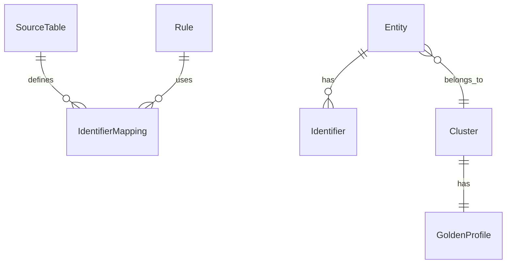

# Data Model

Conceptual Entity-Relationship Diagram.

## Diagram

## Key Concepts

### Entities
A distinct record from a source table (e.g., a row in `Salesforce.Contacts`).
*   Key: `entity_key` (Source + PCK)

### Identifiers
A piece of evidence used to link entities (e.g., `john@example.com`).
*   Type: `EMAIL`, `PHONE`, `DEVICE_ID`.

### Clusters
A group of entities resolved to the same real-world person.
*   Key: `resolved_id`.

### Golden Profile
The consolidated "Best Version" of the person, derived from all entities in the cluster using **Survivorship Rules**.
