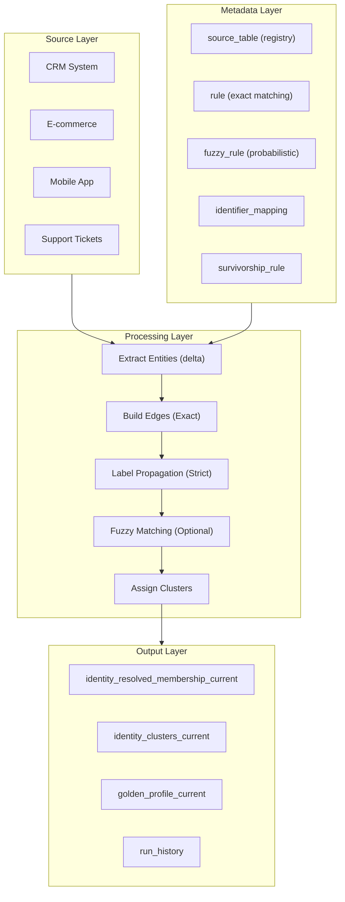

# Architecture

This document describes the system architecture of SQL Identity Resolution.

---

## High-Level Architecture



---

## Cross-Platform Design

The same core logic runs on all platforms via adapters:

```mermaid
graph LR
    subgraph Core["Core Logic"]
        A[DDL Schema]
        B[Edge Building (SQL)]
        C[Label Propagation (SQL)]
        D[Fuzzy Logic (Platform Native)]
    end

    subgraph Adapters["Platform Adapters"]
        DA["DuckDB"]
        SN["Snowflake"]
        BQ["BigQuery"]
        DB["Databricks"]
    end

    Core --> DA
    Core --> SN
    Core --> BQ
    Core --> DB
```

---

## Schema Design

### idr_meta (Configuration)

| Table | Purpose |
|-------|---------|
| `source_table` | Registry of source tables to process |
| `rule` | Exact matching rules |
| `fuzzy_rule` | Probabilistic matching rules |
| `identifier_mapping` | Maps source columns to identifier types |
| `entity_attribute_mapping` | Maps attributes (e.g., name, address) |
| `survivorship_rule` | Logic for selection Golden Profile value |
| `identifier_exclusion` | Blocklist for bad data |
| `run_state` | Watermark tracking |

### idr_work (Processing)

Transient tables used during execution.

| Table | Purpose |
|-------|---------|
| `entities_delta` | Entities to process this run |
| `identifiers` | Extracted identifier values |
| `edges_new` | Entity pairs with matching identifiers |
| `lp_labels` | Label propagation state |
| `fuzzy_results` | Probabilistic match pairs |

### idr_out (Output)

| Table | Purpose |
|-------|---------|
| `identity_resolved_membership_current` | Entity → Cluster mapping |
| `identity_clusters_current` | Cluster metadata (size, confidence) |
| `golden_profile_current` | Best-record profiles per cluster |
| `run_history` | Audit log of all runs |
| `dry_run_results` | Proposed changes (Dry Run Mode) |
| `skipped_identifier_groups` | Audit of skipped supernodes |

---

## Next Steps

- [Matching Algorithm](matching-algorithm.md) - Deep dive into label propagation and fuzzy logic
- [Data Model](data-model.md) - Complete schema reference
- [Configuration](../guides/configuration.md) - Setting up rules
