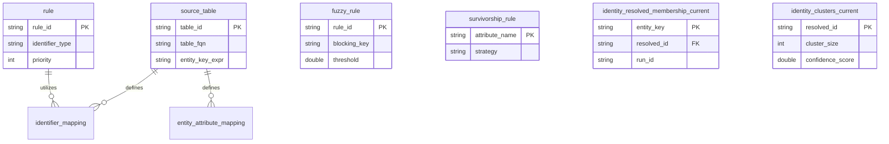

# Data Model

Complete reference for the SQL Identity Resolution data model.

---

## Schema Overview

---

## Core Tables (idr_meta)

### Configuration

*   **`source_table`**: Registry of tables to ingest. Defines how to read data (`table_fqn`, `entity_key_expr`) and handle incremental updates (`watermark_column`).
*   **`rule`**: Defines "Exact Match" logic. E.g., "Link entities that share the same normalized EMAIL".
*   **`fuzzy_rule`**: Defines "Probabilistic Match" logic. E.g., "Link entities if Jaro-Winkler similarity of Name > 0.9".
*   **`survivorship_rule`**: Defines how to pick the best "Golden Record" values (e.g., specific source priority or most recent).

### Mappings

*   **`identifier_mapping`**: Maps a source column to a standard Identifier Type (e.g., `customers.email` -> `EMAIL`).
*   **`entity_attribute_mapping`**: Maps a source column to a Golden Profile attribute (e.g., `customers.fname` -> `first_name`).

### Exclusions & Blocklists

*   **`identifier_exclusion`**: Prevents "Bridge" or "Supernode" issues by ignoring common values (e.g., `support@company.com`, `000-000-0000`).

---

## Output Tables (idr_out)

### The Identity Graph

The core output is the **Identity Graph**, represented by two tables:

1.  **`identity_resolved_membership_current`**: The "Lookup Table".
    *   **Keys**: Source Entity Key (`entity_key`).
    *   **Values**: Resolved Cluster ID (`resolved_id`).
    *   **Usage**: Join this to your source tables to group records by customer.

2.  **`identity_clusters_current`**: The "Cluster Metadata".
    *   **Keys**: Resolved Cluster ID (`resolved_id`).
    *   **Values**: Size (`cluster_size`), Confidence Score (`confidence_score`), and metadata.

### Golden Profile

*   **`golden_profile_current`**: A single, consolidated record for each Cluster ID, containing the best available contact information and attributes based on `survivorship_rule`s.

### Audit & History

*   **`run_history`**: Detailed logs of every pipeline execution.
*   **`dry_run_results`**: (If enabled) Proposed changes from a simulation run.
*   **`edge_evidence`**: (Optional) Micro-level details on exactly which rule created which edge.
