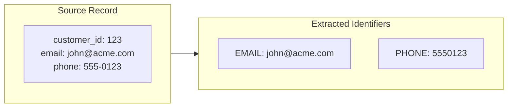
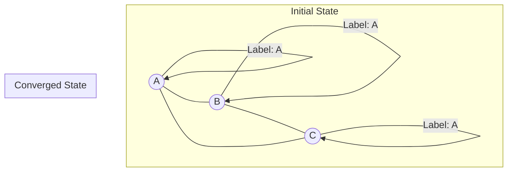

# Matching Algorithm

This document explains the two-stage matching algorithm used in SQL Identity Resolution.

---

## Overview

The algorithm operates in two main stages:

1.  **Strict Deterministic Matching**: Uses **Label Propagation** on a graph of entities connected by exact shared identifiers.
2.  **Fuzzy Matching (Optional)**: Refines clusters using probabilistic rules (e.g., Jaro-Winkler) if strict mode is disabled.

---

## Phase 1: Deterministic Matching

### Step 1: Identifier Extraction

Extract identifiers from source entities based on mapping rules.


**Normalization**: Email (lowercase + trim), Phone (digits only).

### Step 2: Anchor-Based Edge Building

To avoid the $O(N^2)$ explosion of fully connecting large groups, we use an **Anchor-Based** approach.
The entity with the alphanumeric minimum `entity_key` in a group becomes the "Anchor". All other entities in the group create a single edge to the Anchor.

**Example Group**: A, B, C share `john@acme.com`.
- Anchor: A (min key)
- Edges: B->A, C->A.
- Total Edges: 2 (instead of 3).

```sql
-- Conceptual SQL Logic
JOIN valid_groups g ON i.identifier_type = g.identifier_type
    AND i.identifier_value_norm = g.identifier_value_norm
WHERE i.entity_key != g.anchor_key
```

### Step 3: Label Propagation

Iteratively propagate the minimum label along edges until convergence (Connected Components).



---

## Phase 2: Fuzzy Matching

If `strict: false`, the system runs a second pass on the formed clusters.

1.  **Blocking**: Efficiently groups candidate clusters using a `blocking_key` (e.g., Soundex of Name).
2.  **Scoring**: Calculates similarity scores using platform-native functions (e.g., `jarowinkler_similarity`).
3.  **Thresholding**: If `score > threshold`, the clusters are merged.

**Deterministic Hash Ordering**:
To ensure reproducibility across distributed systems (Spark, BigQuery), we do not rely on random IDs.
When comparing two clusters, we hash their IDs:
```python
if md5(id_a) < md5(id_b):
    compare(a, b)
```
This guarantees that `A` and `B` are always compared in the same order, regardless of distributed shuffle.

---

## Handling Edge Cases

### Large Groups (Hub Flattening)
To prevent "Supernodes" (e.g., `null@test.com` linking 1M people), we enforce `max_group_size`.
- Groups larger than the limit are **skipped entirely** from edge generation.
- These are logged to `idr_out.skipped_identifier_groups`.

### Singletons
Entities with no matching identifiers (or only skipped identifiers) are assigned a `resolved_id` equal to their own `entity_key`.

---

## Complexity Analysis

| Step | Time Complexity | Space Complexity |
|------|-----------------|------------------|
| Identifier Extraction | $O(N)$ | $O(N \times M)$ |
| Edge Building (Anchor) | $O(N)$ | $O(N)$ |
| Label Propagation | $O(I \times E)$ | $O(N)$ |
| Fuzzy Matching | $O(C \times K)$ | $O(C)$ |

Where:
- $N$ = entities
- $M$ = identifiers per entity
- $I$ = iterations
- $E$ = edges (linear with anchor method)
- $C$ = number of clusters
- $K$ = avg candidates per block
