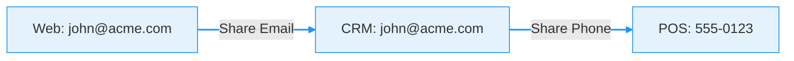

---
tags:
  - identity-resolution
  - customer-360
  - cdp
  - data-warehouse
  - narrative
---

# Act I: The Identity Crisis

**Your customer is everywhere, but your data is scattered.**

They bought sneakers online. They visited your store in SoHo. They opened a support ticket for a size exchange. In reality, this is **one person**. In your data warehouse, it looks like **three strangers**:

| System | Identifier | Record ID | The Problem |
|:---|:---|:---|:---|
| **E-commerce** | `john.doe@gmail.com` | `u_123` | Only knows purchase history |
| **POS System** | `555-0123` | `c_987` | Only knows store visits |
| **Zendesk** | `j.doe@work.com` | `t_456` | Only knows the complaint |

Without identity resolution, you can't answer simple questions:
*   *"What is John's total lifetime value?"*
*   *"Did the support ticket affect his next purchase?"*
*   *"Should we send him a 'Welcome Back' email?"*

---

## The Solution: Warehouse-Native Identity

The traditional answer was to buy an expensive Customer Data Platform (CDP). You would export your data, send it to their "black box," pay for processing, and wait for the results to come back.

**SQL Identity Resolution (IDR) flips the script.**

Instead of moving your data to the engine, **we bring the engine to your data.**

-   :material-server-network:{ .lg .middle } **Your Infrastructure**

    ---

    Running directly inside **Snowflake, BigQuery, Databricks, or DuckDB**. No third-party SaaS to trust.

-   :material-shield-lock:{ .lg .middle } **Your Security**

    ---

    Data never leaves your VPC. Your governance, your RBAC, your compliance rules apply automatically.

-   :material-speedometer:{ .lg .middle } **Your Performance**

    ---

    Leverages the massive parallel processing power you already pay for. Deterministic matching at scale.

-   :material-currency-usd-off:{ .lg .middle } **Your Terms**

    ---

    Open source. Zero licensing fees. Full code transparency.

### How It Works

We use **Deterministic Graph Matching** with **Label Propagation**. It sounds complex, but it follows simple rules you define: "If two records share a verified email, they are the same person."

The engine connects these dots across millions of records to assign a single, persistent **`resolved_id`** to every interaction.

---

## Start Your Journey

You don't need a year-long implementation project. You can see your data unified in 5 minutes.

-   :material-flash: [**Act II: First Contact**](getting-started/quickstart.md)

    Run the demo and see the engine in action.

-   :material-map-marker-path: [**Act III: Building Your Truth**](guides/configuration.md)

    Define *your* rules for *your* business.

